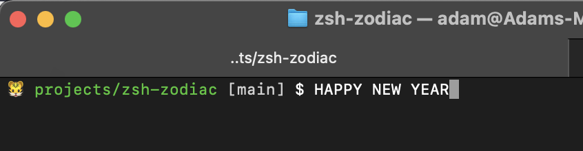

# zsh-zodiac
zsh theme with zodiac animals

Fairly pointless zsh theme that changes the prompt to include the emoji for the animal corresponding to the current year.
The years are mapped according to the Western calendar, since working out the dates for the Lunar New Year is too much work, so the change happens on 1/1 each year.

Installation is done just like any other zsh theme.

You can also alter the prompt to your liking and just include the `$(zodiac)` for the emoji itself.

